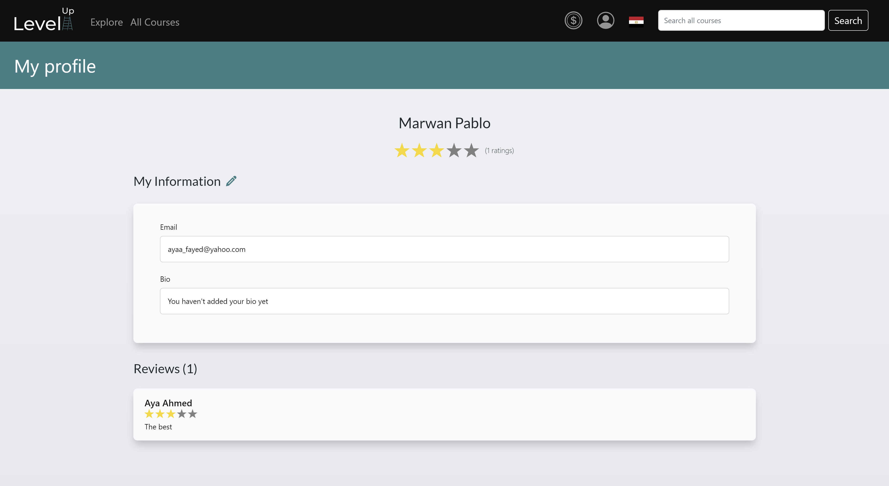
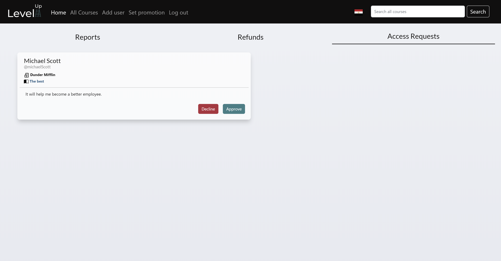

# Level Up

[](https://travis-ci.org/joemccann/dillinger)

Level Up is an online learning platform that an instructor can use to publish their courses and trainees can use to enrol in these courses to improve their knowledge and skills, also corporates can use it to train their employees and give them access to some learning material published on our website.

# Motivation

In the past decade people all around the world satrted heading for learning new skills through online learning platfrom and instructor started posting valuable learning materials all over the internet. The Main idea behind Level Up is to allow instructors to post the content from outside open sources and create a unified platform for online learning and that contains multiple materials from different sources.

# Features

- If you are an instructor , you can:
  - Create a course and sets its price.
  - Set promotions on your courses.
  - Upload the course content.
  - Add exercises to the course.
  - View their earnings each month.
  - See the number of enrolled trainees in each course.
  - See their ratings and reviews.
  - Search and view their courses.
  - Report any issue.
- If you are a trainee , you can:
  - Browse, search and filter all the courses published on the website.
  - View the details of any course.
  - See the trending courses.
  - Pay and enroll in a course.
  - View the content and solve the exercises of their enrolled courses.
  - Rate and review the courses they are enrolled in.
  - Rate and review the instructors of the courses they are enrolled in.
  - View the ratings and reviews of any course or instructor.
  - Report any issue.
  - Refund a course and get its amount back in their wallet.
- If you are a corporate trainee, you can:
  - Browse, search and filter all the courses published on the website.
  - View the details of any course.
  - See the trending courses.
  - Request access for a course.
  - View the content and solve the exercises of their enrolled courses.
  - Rate and review the courses they are enrolled in.
  - Rate and review the instructors of the courses they are enrolled in.
  - View the ratings and reviews of any course or instructor.
  - Report any issue.
- If you are an admin, you can:
  - Add other admins to the system.
  - Add instructors.
  - Add corporate trainees.
  - Set promotions on selected/all courses.
  - Approve access requests for courses.
  - Approve refund requests.
  - View the reported issues.

# Screenshots & How to Use

### Explore

  

### All courses

  

### Sign Up

  

### Log in

  

### Course details

  

### Course content

  

### Solve Exercises

  
  
### Create course

  

### Instructor profile

  

### Instructor earnings

  

### Admin view reports

  

### Admin view corporate trainees access requests for courses

  

### Admin set promotion

  

# Code Style

The application is built in Client/Server architecture, where the server logic is written in `server` directory and the client is in `client` directory.

## Technology

Level Up uses a number of open source projects to work properly:

- [React](https://reactjs.org/) - Front-end
- [mui](https://mui.com/) - UI
- [React Bootstrap](https://react-bootstrap.github.io/) - UI
- [node.js] - Backend
- [Express] - Backend
- [MongoDB](https://www.mongodb.com/home) - Database

## Installation & Running

Install the dependencies and start the server.

```sh
cd client
npm i --force
cd ..
cd server
npm i
npm start
```

## API Refrence

### login

---

**request**:

```r
POST localhost:8080/login
```

**body**:

```json
{
  "username": "$username",
  "password": "$password"
}
```

**response**:

```json
{
  "userType": "admin | trainee | instructor | corporateTrainee",
  "userId": "$userId",
  "firstName": "$userFirstName",
  "lastName": "$userLastName",
  "userName": "$username",
  "corporateName": "corporateName" // if corporate trainee only
}
```

### Explore

---

Get the featured courses.
**request**:

```r
GET localhost:8080
```

**response**:

```json
[
  {
      "id": "$courseId",
      "price": "$price",
      "duration": "$duration",
      "instructorName": "$instructorInfo?.instructorName",
      "name": "$name",
      "subject": "$subject",
      "totalRating": "$totalRating",
      "ratingsCount": "$ratingsCount",
      "image": "imageURL"
    },
    {
      "id": "$courseId",
      ...
    }
    ...
]
```

### Sign Up

---

**request**:

```r
POST localhost:8080/signup
```

**body**:

```json
{
  "username": "$username",
  "password": "$password",
  "email": "$email",
  "gender": "$gender",
  "firstName": "$firstName",
  "lastName": "$lastName"
}
```

**response**:

```json
{
  "userType": "trainee",
  "userId": "$userId",
  "firstName": "$userFirstName",
  "lastName": "$userLastName",
  "userName": "$username"
}
```

### Convert Currency

---

**request**:

```r
POST localhost:8080/convertCurrency
```

**body**:

```json
{
  "magnitude": "$magnitude",
  "oldCurrency": "$oldCurrency",
  "newCurrency": "$newCurrency"
}
```

**response**:

```json
{
  "magnitude": "$newMagnitude",
  "currency": "$newCurrency"
}
```

### Search

---

**request**:

```r
POST localhost:8080/search
```

**body**:

```json
{
  "query": "$query"
}
```

**response**:

```json
[
  {
      "id": "$courseId",
      "price": "$price",
      "duration": "$duration",
      "instructorName": "$instructorInfo?.instructorName",
      "name": "$name",
      "subject": "$subject",
      "totalRating": "$totalRating",
      "ratingsCount": "$ratingsCount",
      "image": "imageURL"
    },
    {
      "id": "$courseId",
      ...
    }
    ...
]
```

### Reset Password

---

**request**:

```r
POST localhost:8080/resetPassword
```

**body**:

```json
{
  "userID": "$userID",
  "token": "$token",
  "confirmNewPassword": "$confirmNewPassword"
}
```

### Add Instructor

---

**request**:

```r
POST localhost:8080/admin/addInstructor
```

**body**:

```json
{
  "username": "$username",
  "password": "$password",
  "email": "$email",
  "firstName": "$firstName",
  "lastName": "$lastName",
  "gender": "$gender"
}
```

**response**:

```json
{
  "message": "success"
}
```

### Add Admin

---

**request**:

```r
POST localhost:8080/admin/addAdmin
```

**body**:

```json
{
  "username": "$username",
  "password": "$password"
}
```

**response**:

```json
{
  "message": "success"
}
```

### Add Corporate Trainee

---

**request**:

```r
POST localhost:8080/admin/corporateTrainee
```

**body**:

```json
{
  "username": "$username",
  "password": "$password",
  "email": "$email",
  "firstName": "$firstName",
  "lastName": "$lastName",
  "gender": "$gender",
  "corporateName": "$corporateName"
}
```

**response**:

```json
{
  "message": "success"
}
```

### Refunds

---

**request**:

```r
GET localhost:8080/admin/refunds
```

**response**:

```json
[
  {
    "_id": "id",
    "userId": "$userId" ,
    "courseId": "$courseId",
    "userName": "$userName",
    "courseName": "$courseName",
    "reason": "$reason",
    "uniqueUserName": "$uniqueUserName"
  },
  {
    "_id": "id",
    ...
  }
  ...
]
```

### Approve Refunds

---

**request**:

```r
POST localhost:8080/admin/approveRefund
```

**Body**:

```json
{
  "userId": "$userId",
  "courseId": "$courseId"
}
```

**response**:

```json
{
  "message": "Refund Approved"
}
```

### Decline Refunds

---

**request**:

```r
POST localhost:8080/admin/declineRefund
```

**Body**:

```json
{
  "userId": "$userId",
  "courseId": "$courseId"
}
```

**response**:

```json
{
  "message": "Refund Declined"
}
```

### Reports

---

**request**:

```r
GET localhost:8080/admin/reports
```

**response**:

```json
{
  "resolved": [
      {
        "resolved reports"
      }
    ],
  "unresolved": [
      {
        "unresolved reports"
      }
    ]
}
```

### Approve Course Access Request

---

**request**:

```r
POST localhost:8080/admin/requests/approve/:id
```

**response**:

```json
Approved Successfully
```

### Decline Course Access Request

---

**request**:

```r
POST localhost:8080/admin/requests/decline/:id
```

**response**:

```json
declined Successfully
```

### Create Course

---

**request**:

```r
POST localhost:8080/instructor/createCourse
```

**body**:

```json
{
  "description": "$description",
  "name": "$name",
  "subject": "$field",
  "price": { "magnitude": "$magnitude", "currency": "$currency" },
  "instructorInfo": {
    "instructorId": "$userId",
    "instructorName": "$userName",
  },
  "duration": 0,
  "introVideo": "$introVideo",
  "image": "$image",
  "subtitles": ["sub1", ...]
}
```

**response**:

```json
{
  "description": "$description",
  "name": "$name",
  "subject": "$field",
  "price": { "magnitude": "$magnitude", "currency": "$currency" },
  "instructorInfo": {
    "instructorId": "$userId",
    "instructorName": "$userName",
  },
  "duration": 0,
  "introVideo": "$introVideo",
  "image": "$image",
  "ratings": [],
  "totalRating": 0,

  "trainees": [],
  "subtitles": ["$subID",...],
  "pendingTrainees": [],
  "refundingTrainees": [],
  "published": false
}
```

### Get Instructor's Courses

---

**request**:

```r
GET localhost:8080/insttructor/myCourses
```

**Response**:

```json
[
  {
      "id": "$courseId",
      "price": "$price",
      "duration": "$duration",
      "instructorName": "$instructorName",
      "name": "$name",
      "subject": "$subject",
      "totalRating": "$totalRating",
      "ratingsCount": "$ratingsCount",
      "image": "imageURL"
    },
    {
      "id": "$courseId",
      ...
    }
    ...
]
```

### Get Instructor's Profile

---

**request**:

```r
GET localhost:8080/insttructor/myCourses
```

**Response**:

```json
{
  "firstName": "$firstName",
  "lastName": "$lastName",
  "about": "$about",
  "email": "$email",
  "ratings": ["$ratings"],
  "totalRating": "$totalRatings"
}
```

### Get Course Exercise

---

**request**:

```r
GET localhost:8080/course/subtitle/excercise/:id
```

**Response**:

```json
{
  "Questions": ["$Questions"],
  "Visits": [{"$visit"}],
  "Mark": {
    "$traineeId",
    "$mark"
   },
}
```

### Get Course Subtitle

---

**request**:

```r
GET localhost:8080/course/subtitle/:id
```

**Response**:

```json
{
  "subtitleNumber": "$subtitleNumber",
  "courseId": "$courseId",
  "title": "$title",
  "subTitle_Content": [
    "subTitle_Content_id": "$subTitle_Content_id",
    "type": "excercise | content"
  ]
}
```

### Get Course Details

---

**request**:

```r
GET localhost:8080/course/:id
```

**Response**:

```json
{
  "description": "$description",
  "name": "$name",
  "subject": "$field",
  "price": { "magnitude": "$magnitude", "currency": "$currency" },
  "instructorInfo": {
    "instructorId": "$userId",
    "instructorName": "$userName",
  },
  "duration": 0,
  "introVideo": "$introVideo",
  "image": "$image",
  "ratings": [],
  "totalRating": 0,

  "trainees": [],
  "subtitles": ["$subID",...],
  "pendingTrainees": [],
  "refundingTrainees": [],
  "published": false
}
```

### Report Course

---

**request**:

```r
POST localhost:8080/course/report
```

**Body**:

```json
{
  "courseId": "$courseId",
  "problemType": "$problemType",
  "problemBody": "$problemBody",
  "userName": "$userName",
  "courseName": "$courseName",
  "problemSummary": "$problemSummary",
  "uniqueUserName": "$uniqueUserName"
}
```

**Response**:

```json
{
  "userId": "$userId",
  "courseId": "$courseId",
  "problemType": "$problemType",
  "body": "$problemBody",
  "userName": "$userName",
  "courseName": "$courseName",
  "summary": "$problemSummary",
  "uniqueUserName": "username"
}
```

## Code Example

---

### Course Routes

---

```js
router.delete("/:id/cancelRefundRequest", canCancelRefund, cancelRefund);
router.get("/subtitle/excercise/:id", getExcercise);
router.patch("/subtitle/video/:id/addNote", updateNote);
router.get("/subtitle/video/:id/getNote", getNote);
router.get("/subtitle/video/:id", getVideo);
router.get("/subtitle/:id", getSubtitle);
router.patch("/subtitle/isVisited/:conID/:contentType", updateVisits);
router.get("/subtitle/isVisited/:conID/:contentType", getVisits);
router.get("/:id", getCourseDetails);
router.patch("/report/:id", updateStatus);
router.patch("/addRating", canRateCourse, addReview);
router.patch("/deleteRating", canDeleteRating, deleteRating);
router.patch("/addPromotion", canAddPromotion, addPromotion);
router.patch("/addMultiPromotion", canAddMultiPromotion, addMultiPromotion);
router.patch("/:id", updateCourse);
router.patch("/:id/newsubtitle", createSubtitle);
router.patch("/:id/publishCourse", publishCourse);
router.post("/report", canReport, submitReport);
router.post("/requestAccess", canRequestAccess, requestAccess);
router.post("/requestRefund", canRequestRefund, requestRefund);
router.post("/addFollowup", canAddFollowup, addFollowup);
```

### Add Admin Controller

---

```js
const bcrypt = require("bcryptjs");
const User = require("../../models/User.model");

exports.addAdmin = async (req, res) => {
  try {
    const exists = await User.findOne({ username: req.body.username });
    if (exists) {
      res.status(500).json({ message: "This username already exists" });
    } else {
      const encryptedPassword = await bcrypt.hash(req.body.password, 12);
      const Admin = await User.create({
        username: req.body.username,
        password: encryptedPassword,
      });
      res.status(200).json({ message: "success" });
    }
  } catch (err) {
    res
      .status(500)
      .json({ message: "There was a network error. Try again later" });
  }
};
```

### Access Requests Controller

---

```js
const Request = require("../../models/AccessRequest.model");
const Course = require("../../models/Course.model");
const Trainee = require("../../models/Trainee.model");
const Refund = require("../../models/Refund.model");

const getRequests = async (req, res) => {
  try {
    const accessRequests = await Request.find({});
    res.status(200).json(accessRequests);
  } catch (err) {
    res.status(500).json({ message: err.message });
  }
};
const updateAndDelete = async (course, request) => {
  let pendingTrainees = [];
  for (let i = 0; i < course.pendingTrainees.length; i++) {
    if (course.pendingTrainees[i].toString() !== request.userId.toString()) {
      pendingTrainees.push(course.pendingTrainees[i]);
    }
  }
  course.pendingTrainees = pendingTrainees;
  await course.save();
  await Request.deleteOne({ _id: request._id });
};

const deleteRequest = async (req, res) => {
  try {
    const request = await Request.findById(req.params.id);
    const course = await Course.findById(request.courseId);
    await updateAndDelete(course, request);
    res.status(200).send("deleted successfully");
  } catch (err) {
    res.status(500).json({ message: err.message });
  }
};

const approveRequest = async (req, res) => {
  try {
    const request = await Request.findById(req.params.id);
    const course = await Course.findById(request.courseId);
    const trainees = [...course.trainees];
    trainees.push(request.userId);
    course.trainees = trainees;
    await updateAndDelete(course, request);
    const trainee = await Trainee.findById(request.userId);
    trainee.courses.push(request.courseId);
    await trainee.save();
    res.status(200).send("Approved Successfully");
  } catch (err) {
    res.status(500).json({ message: err.message });
  }
};

module.exports = { getRequests, deleteRequest, approveRequest };
```

### Create Course Controller

---

```js
const Content = require("../../models/Content.model");
const Course = require("../../models/Course.model");
const InstructorModel = require("../../models/Instructor.model");
const Subtitle = require("../../models/Subtitle.model");

const createCourse = async (req, res) => {
  try {
    const course = await Course.create({
      description: req.body.description,
      name: req.body.name,
      subject: req.body.field,
      price: { magnitude: req.body.magnitude, currency: req.body.currency },
      instructorInfo: {
        instructorId: req.session.userId,
        instructorName: req.session.userName,
      },
      duration: 0,
      introVideo: req.body.introVideo,
      image: req.body.image,
    });
    const subtitles = [];
    for (let i = 0; i < req.body.subtitles.length; i++) {
      const subtitle = await Subtitle.create({
        subtitleNumber: i + 1,
        title: req.body.subtitles[i],
        courseId: course._id,
      });
      subtitles.push(subtitle._id);
    }
    await Course.findByIdAndUpdate(course._id, { subtitles: subtitles });
    await updateInstructorCourses(course._id, req.session.userId);
    res.status(200).json({ courseId: course._id });
  } catch (err) {
    res.status(500).json({ message: err.message });
  }
};

const updateInstructorCourses = async (courseId, instructorId) => {
  const instructor = await InstructorModel.findById(instructorId);
  let updatedCourses = instructor.courses;
  updatedCourses.push(courseId);
  await InstructorModel.findByIdAndUpdate(instructorId, {
    courses: updatedCourses,
  });
};
module.exports = { createCourse };
```

### Background Color CSS Classes

---

```css
.blackBg {
  background-color: #100f0f !important;
  border: 1px solid #100f0f !important;
  color: white !important;
}

.blueBg {
  background-color: #297f87 !important;
  border: 1px solid #297f87 !important;
  color: white !important;
}
.greyBg {
  background-color: #9d9d9d !important;
  border: 1px solid #9d9d9d !important;
  color: white !important;
}
.redBg {
  background-color: #ba2d3d !important;
  border: 1px solid #ba2d3d !important;
  color: white !important;
}
```

### App.jsx Component Body

---

```jsx
function App() {
  const [country, setCountry] = useState(ReactSession.get("country") ?? "EG");
  const [userType, setUserType] = useState(ReactSession.get("userType") ?? "");
  ReactSession.set("country", country);
  ReactSession.set("userType", userType);
  return (
    <>
      <Navbar setCountry={setCountry} setUserType={setUserType} />
      <Routes>
        <Route path="/" element={<Explore />} />
        <Route path="/allCourses" element={<Filter />} />
        <Route path="/myCourses" element={<MyCourses />} />
        <Route path="/search/:searchQuery" element={<Search />} />

        <Route path="/course/:courseId" element={<CourseDetails />} />
        <Route path="/addUser" element={<AddUser />} />
        <Route path="/CreateCourse" element={<CreateCourse />} />
        <Route path="/login" element={<Login setUserType={setUserType} />} />
        <Route path="/watch/:courseId" element={<Content />} />
        <Route path="/excercise/:excerciseID" element={<Excercise />} />

        <Route
          path="/viewInstructorProfile/:isEnrolled/:instructorID"
          element={<ViewInstructorProfile />}
        />
        <Route path="/forgetPassword" element={<ForgetPassword />} />
        <Route path="/changePassword" element={<ChangePassword />} />
        <Route path="/myProfile" element={<MyProfile />} />
        <Route
          path="/resetPassword/:userID/:token"
          element={<ResetPassword />}
        />
        <Route
          path="/editSubtitle/:courseID/:subtitleID"
          element={<EditSubtitle />}
        />
        <Route path="/myProblems" element={<MyProblems />} />
        <Route path="/adminHome" element={<AdminHome />} />
        <Route path="/earnings" element={<Earnings />} />
        <Route path="/enrolledCourses" element={<EnrolledCourses />} />
        <Route path="/setPromotion" element={<SetpromotionPage />} />
        <Route path="/signup" element={<Signup setUserType={setUserType} />} />
      </Routes>
    </>
  );
}
```

### Access Request Card

---

```jsx
function AccessRequestCard(props) {
  const {
    request,
    accessRequests,
    setAccessRequests,
    setFail,
    setSuccess,
    setMsg,
  } = props;
  const [approveLoading, setApproveLoading] = useState(false);
  const [declineLoading, setDeclineLoading] = useState(false);
  const deleteRequest = (id) => {
    const newAccessRequests = accessRequests.filter(
      (element) => element._id != id
    );
    setAccessRequests(newAccessRequests);
  };
  const approve = async () => {
    setApproveLoading(true);
    try {
      await approveAccessRequest(request._id);
      deleteRequest(request._id);
      setSuccess(true);
      setMsg("Access request approved successfully!");
    } catch (err) {
      setFail(true);
    }
    setApproveLoading(false);
  };

  const decline = async () => {
    setDeclineLoading(true);
    try {
      await declineAccessRequest(request._id);
      deleteRequest(request._id);
      setSuccess(true);
      setMsg("Access request declined successfully!");
    } catch (err) {
      setFail(true);
    }
    setDeclineLoading(false);
  };
  return (
    <div id="accessRequestContainer" className="whiteCard">
      <Row md={2} id="accessRequestHeader">
        <Col>
          <h4>
            {request.userName}
            <br /> <h6 className="greyTxt">{"@" + request.uniqueUserName}</h6>
          </h4>
          <small>
            <BiBuildings size={18} />
            <b>{" " + request.corporateName}</b>
            <br />
          </small>
          <small>
            <b>
              <BsBookHalf size={16} />
              <a
                href={"/course/" + request.courseId}
                id="problemCourseNameLink"
              >
                {" " + request.courseName}
              </a>
            </b>
            <br />
          </small>
        </Col>
        <Col></Col>
      </Row>
      <hr className="m-1" />
      <div id="accessRequestBody">{request.reason}</div>
      <div id="accessRequestFooter">
        <Button
          onClick={() => decline()}
          className="redBgHover accessRequestButton"
          disabled={approveLoading || declineLoading}
        >
          Decline{" "}
          {declineLoading ? (
            <Spinner
              as="span"
              animation="border"
              size="sm"
              role="status"
              aria-hidden="true"
            />
          ) : null}
        </Button>
        <Button
          onClick={() => approve()}
          className="blueBgHover accessRequestButton"
          disabled={approveLoading || declineLoading}
        >
          Approve{" "}
          {approveLoading ? (
            <Spinner
              as="span"
              animation="border"
              size="sm"
              role="status"
              aria-hidden="true"
            />
          ) : null}
        </Button>
      </div>
    </div>
  );
}
```

### Course Card

```jsx
function CourseCard(props) {
  const [price, setPrice] = useState("");
  const [discount, setDiscount] = useState(null);
  const [currency, setCurrency] = useState("");
  const [duration, setDuration] = useState("");
  const [subject, setSubject] = useState("");
  const [loading, setLoading] = useState(true);

  const navigate = useNavigate();

  const fetchPrice = async () => {
    setLoading(true);
    try {
      const fetchedPrice = await getPrice({
        magnitude: props.course.price.finalPrice,
        currency: props.course.price.currency,
      });
      let priceStr = fetchedPrice.split(" ");
      setDuration(props.course.duration);
      setSubject(props.course.subject);
      setPrice(priceStr[0]);
      setCurrency(priceStr[1]);
      if (props.course.price.hasPromotion) {
        setDiscount(props.course.price.discount);
      } else {
        setDiscount(null);
      }
      setLoading(false);
    } catch (err) {
      console.log(err);
      setLoading(false);
    }
  };

  useEffect(() => {
    fetchPrice();
  }, [ReactSession.get("country"), props.course]);

  return (
    <Card
      id="courseCardMain"
      sx={{
        maxWidth: 230,
        minWidth: 230,
        maxHeight: 326,
        minHeight: 326,
      }}
      onClick={(e) => navigate("/course/" + props.course.id)}
    >
      <CardActionArea>
        <CardMedia
          component="img"
          height="180"
          width="230"
          image={
            props.course?.image?.length > 0
              ? props.course.image
              : "https://www.pngkey.com/png/detail/350-3500680_placeholder-open-book-silhouette-vector.png"
          }
        />
        {loading ? (
          <CardContent>
            <Placeholder as={Card.Title} animation="glow">
              <Placeholder xs={5} />
            </Placeholder>
            <Placeholder as={Card.Text} animation="glow">
              <Placeholder xs={10} />
              <Placeholder xs={10} />
              <Placeholder xs={10} />
              <Placeholder xs={10} />
            </Placeholder>
          </CardContent>
        ) : (
          <CardContent>
            <Typography variant="h5" component="span">
              {props.course.name}
            </Typography>
            <Typography variant="body2">
              <Stack gap={1}>
                <h6 className="courseCardItem blueTxt mb-1">
                  {props.course.instructorName}{" "}
                  {props.course?.published !== null &&
                  props.course?.published !== undefined &&
                  !props.course?.published ? (
                    <Badge bg="secondary" pill>
                      Unpublished
                    </Badge>
                  ) : null}
                </h6>
                {ReactSession.get("userType") === userTypes.corporateTrainee ? (
                  <h6 className="courseCardItem">
                    <IoBookSharp size={17} color="#100F0F" /> {subject}
                  </h6>
                ) : null}
                <h6 className="courseCardItem">
                  <RiPlayList2Fill size={16} color="#100F0F" /> {duration}
                </h6>
                <h6 id="courseCardRating" className="courseCardItem">
                  <MdOutlineStar size={20} color="#ffd700" />{" "}
                  <span id="courseCardTxt">
                    {props.course.totalRating} <span className="greyTxt">{`(${
                      props.course.ratingsCount
                    } ${
                      props.course.ratingsCount === 1 ? "rating" : "ratings"
                    })`}</span>
                  </span>
                </h6>
                {ReactSession.get("userType") ===
                userTypes.corporateTrainee ? null : (
                  <h6 className="courseCardItem">
                    <MdPayments size={17} color="#100F0F" />{" "}
                    <span id="courseCardTxt">
                      {price} <span className="greyTxt">{currency}</span>
                      {discount ? <span>{` (-${discount}%)`}</span> : null}
                    </span>
                  </h6>
                )}
              </Stack>
            </Typography>
          </CardContent>
        )}
      </CardActionArea>
    </Card>
  );
}
```

## Testing

---

The testing throughout the project was done using API clients (Postman, Thunder) and was for the sake of testing the backend part. Here are few examples.

### Delete request by ID

```sh
DEL localhost:8080/admin/requests/639f8468b90a7088bc3f6cd3
```

### Login

```sh
POST localhost:8080/login
```

- Body

```json
{
  "username": "admin",
  "password": "123456"
}
```

### Get All Access Requests

```sh
GET localhost:8080/admin/requests
```

### Update The Status of Report

```sh
PATCH localhost:8080/course/report/6399b204c88090e76bb37dcb
```

- Body

```json
{
  "status": "Pending"
}
```

### Get All Reports

```sh
GET localhost:8080/admin/reports
```

## Color Palette

---

The background used for the whole website is this gradient: linear-gradient(to top, #E6E9F0 0%, #EEF1F5 100%)

| Color                                                                             | Hex Code |
| --------------------------------------------------------------------------------- | -------- |
|  | #100F0F  |
|  | #297F87  |
|  | #9D9D9D  |
|  | #FFFFFF  |

---

# Credits

This project is delivered by a group of 5 Engineering students at the German University in Cairo:

- [Ziad Ahmed Sadek](https://github.com/ziadsadek999)
- [Aya Ahmed Fayed](https://github.com/AyaFayed)
- [Aly Hassan Elsokkary](https://github.com/Elsokkary101)
- [Abdelrahman Fathy Elsalh](https://github.com/abd0123)
- [Ahmed Moneer Esmail](https://github.com/Itchyyy110)

with the help of all the amazing and supportive TAs and the great professor Dr. Mervat Abu-ElKheir.

# Contribute

If you want to cotribute to this project send us email on (onlinelearningsystem10@gmail.com). And if you have suggestion don't hesitate to open issue about it.

# License

This application is licensed under [MIT](https://github.com/git/git-scm.com/blob/main/MIT-LICENSE.txt) and [Stripe](https://github.com/stripe/stripe-js/blob/master/LICENSE) Licenses.

[//]: # "These are reference links used in the body of this note and get stripped out when the markdown processor does its job. There is no need to format nicely because it shouldn't be seen. Thanks SO - http://stackoverflow.com/questions/4823468/store-comments-in-markdown-syntax"
[node.js]: http://nodejs.org
[express]: http://expressjs.com
